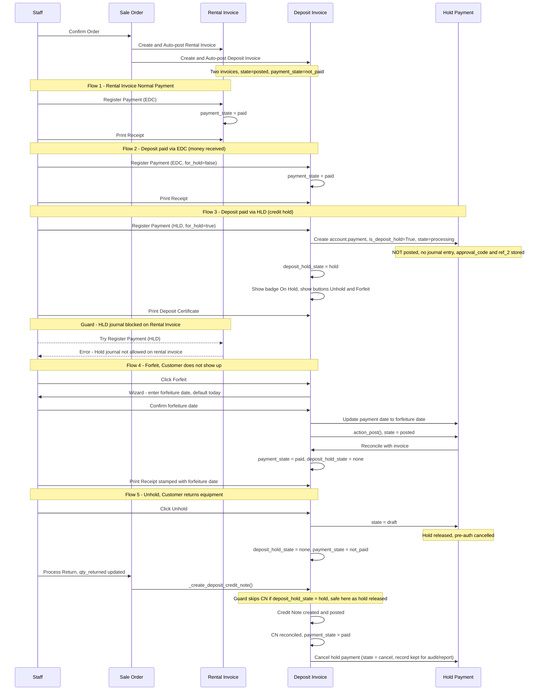
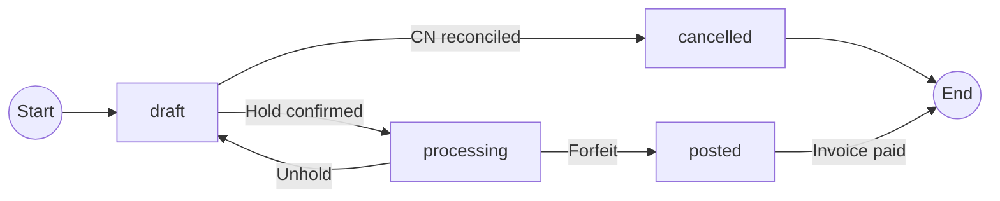

# Hold Payment — Deposit Invoice Flow

## Overview

When a customer pays a security deposit via credit card hold (pre-authorization), the system
creates a hold payment in `processing` state instead of posting a real payment. The deposit
invoice remains outstanding until the hold is either forfeited (No Show) or released (customer returns).

## Journals

| Journal | `for_hold` | Allowed on Rental Invoice | Allowed on Deposit Invoice |
|---------|-----------|--------------------------|---------------------------|
| EDC     | False      | Yes                      | Yes → paid immediately     |
| HLD     | True       | No (blocked)             | Yes → hold state           |

## Document Types

| Scenario | Document Printed |
|----------|-----------------|
| Deposit paid via EDC (money received) | ใบเสร็จ (Receipt) |
| Deposit paid via HLD (credit hold)    | ใบมัดจำ (Deposit Certificate) |
| Deposit forfeited (No Show)           | ใบเสร็จ (Receipt) stamped with forfeiture date |

---

## Sequence Diagram

---

## Payment State Transitions

---

## Key Fields

| Model | Field | Purpose |
|-------|-------|---------|
| `account.journal` | `for_hold` (Boolean) | Marks journal as credit hold type |
| `account.payment` | `is_deposit_hold` (Boolean) | Marks payment as a hold (not a real receipt) |
| `account.payment` | `state = 'processing'` | Custom state: hold active, not yet posted |
| `account.payment` | `state = 'cancel'` | Hold released and CN reconciled — record kept for reporting (approval_code, ref_2 preserved) |
| `account.move` | `deposit_hold_state` (Computed) | `'none'` or `'hold'` — drives UI buttons and badge |

## Guards

| Guard | Location | Condition |
|-------|----------|-----------|
| Block HLD on rental invoice | `account.move.action_register_payment` | `journal.for_hold=True` and invoice is not deposit |
| Block normal post of processing payment | `account.payment.action_post` | `is_deposit_hold=True` and not called from forfeit flow |
| Skip CN creation during active hold | `sale_order_line._create_deposit_credit_note` | `deposit_invoice.deposit_hold_state == 'hold'` |
