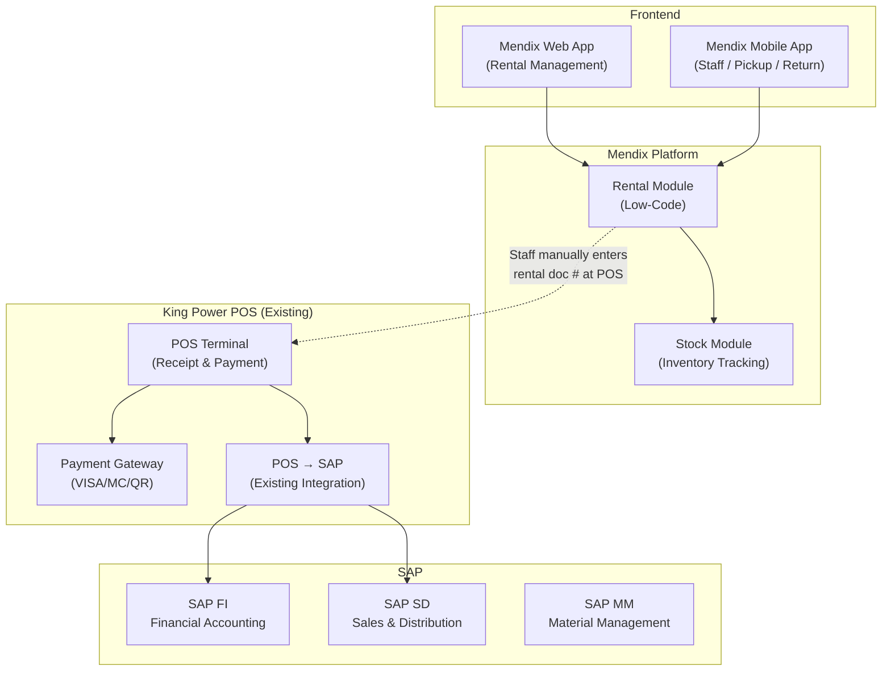
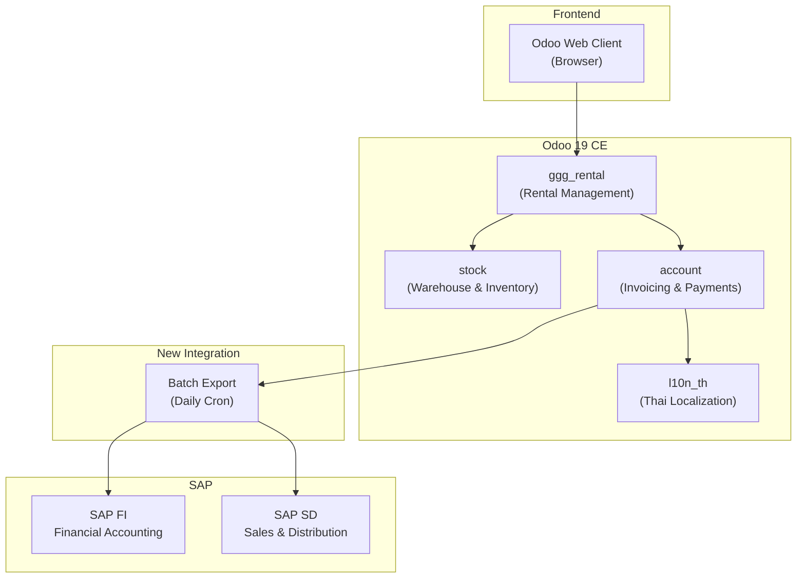
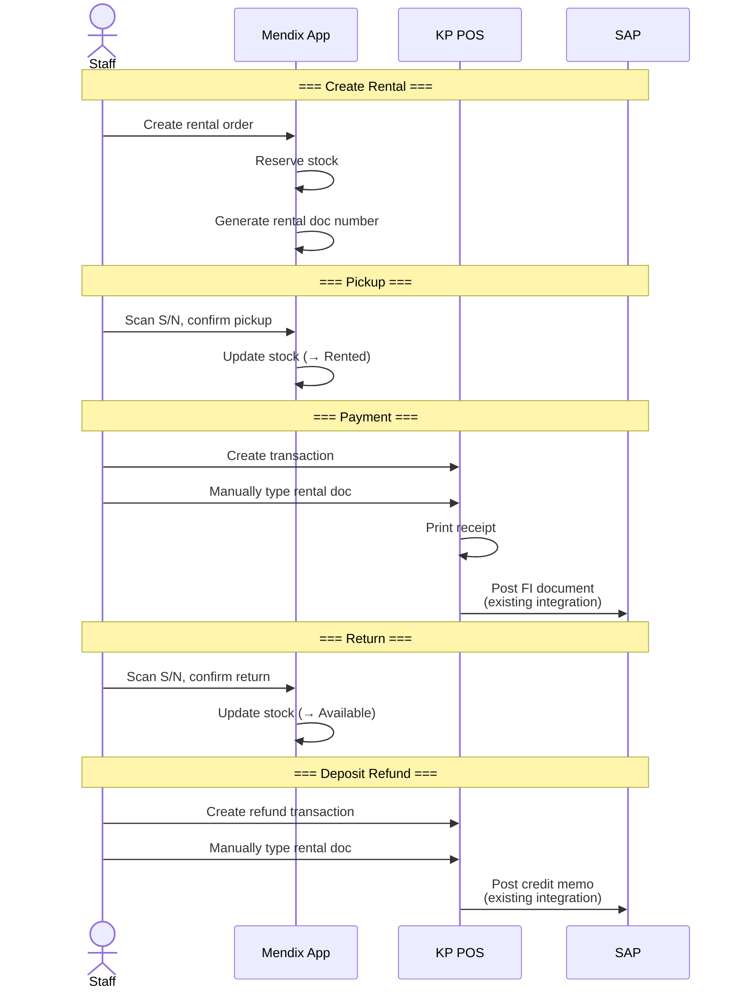
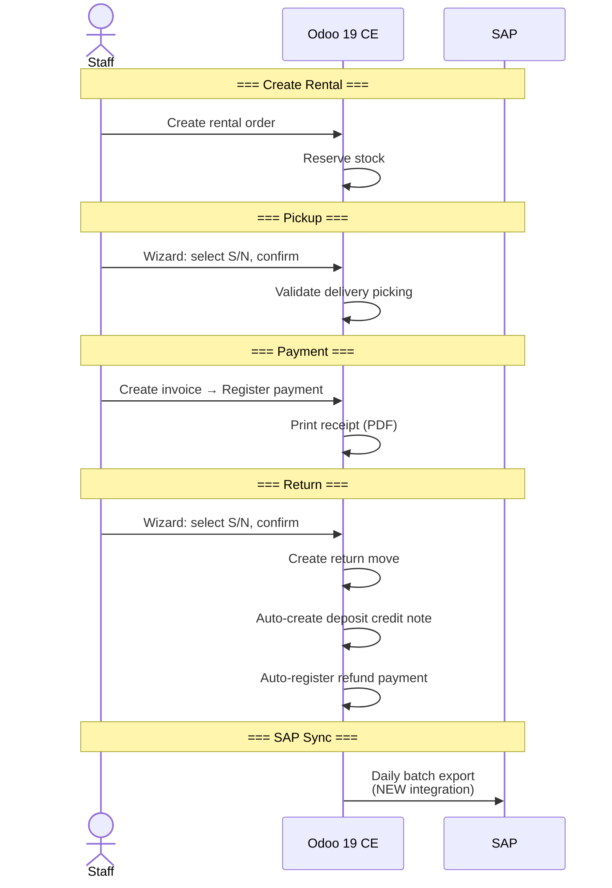
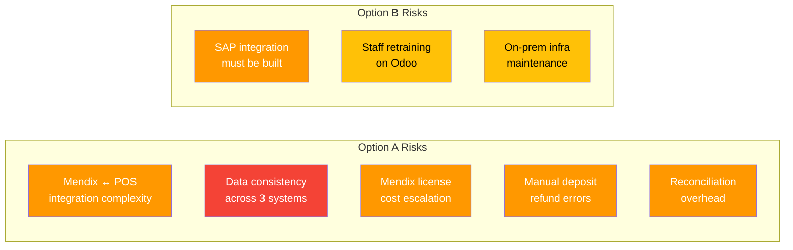
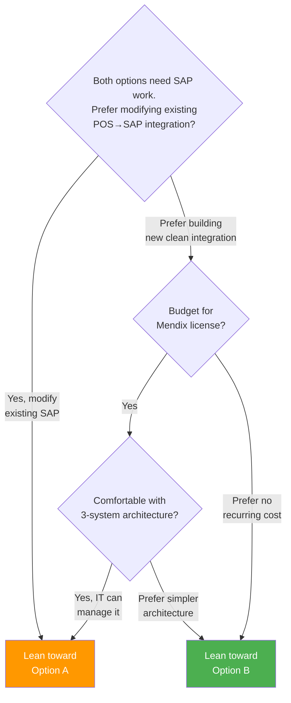

# KP Rental System — Solution Comparison

> Alternative Architecture Assessment
> Version: 1.0 | Date: 2026-03-23

---

## 1. Solution Overview

### Option A: Mendix + King Power POS + SAP (Existing Stack)



### Option B: Odoo 19 CE (Current Approach)



---

## 2. Process Flow Comparison

### Option A: Mendix + POS Flow



### Option B: Odoo Flow



---

## 3. Comparison Matrix

### 3.1 Functional Comparison

| Capability | Option A: Mendix + POS | Option B: Odoo |
|-----------|----------------------|----------------|
| Rental order management | Mendix (build from scratch) | Odoo (built from CLE AI engine) |
| Stock / S/N tracking | Mendix (build from scratch) | Odoo stock module (mature) |
| Payment processing | KP POS (existing) | Odoo payments (built-in) |
| Receipt printing | KP POS (existing) | Odoo PDF report |
| Invoice & credit note | KP POS → SAP | Odoo accounting |
| Deposit management | Manual via POS refund | Auto credit note on return |
| Late fee calculation | Mendix (build) | Odoo (built-in) |
| SAP integration | Existing POS→SAP (but requires significant SAP modification for rental transactions) | New (must build) |
| Reporting | Mendix dashboards (build) | Odoo built-in reports |


### 3.2 Technical Comparison

| Aspect | Option A: Mendix + POS | Option B: Odoo |
|--------|----------------------|----------------|
| Architecture | 3 systems (Mendix + POS + SAP) | 2 systems (Odoo + SAP) |
| Integration points | Mendix → POS (manual, no API) + POS ↔ SAP (existing, needs SAP modification) | Odoo → SAP (new) |
| Data ownership | Split (rental in Mendix, financial in POS/SAP) | Unified (all in Odoo) |
| Stock source of truth | Mendix | Odoo |
| Financial source of truth | SAP (via POS) | SAP (via Odoo batch) |
| Hosting | Mendix Cloud (SaaS) | On-prem Docker |
| Database | Mendix managed | PostgreSQL (self-managed) |
| Customization | Low-code (visual) | No-code (with CLE AI engine) |

### 3.3 Operational Comparison

| Factor | Option A: Mendix + POS | Option B: Odoo |
|--------|----------------------|----------------|
| Staff training | 2 systems (Mendix + POS) | 1 system (Odoo) |
| Daily workflow | Switch between Mendix & POS | Single screen |
| Receipt printing | POS (existing) | PDF report |
| Payment methods | POS (all existing methods) | Odoo (configured journals) |
| Data reconciliation | Mendix ↔ POS ↔ SAP | Odoo → SAP |

---

## 4. Pros & Cons

### Option A: Mendix + King Power POS + SAP

```
 ✅ PROS                                    ❌ CONS
 ─────────────────────────────────────────   ─────────────────────────────────────────
 SAP integration exists (POS→SAP)            3-system architecture (more complexity)
   but needs significant SAP modification     SAP modification required for rental
   for rental transaction types                  transaction types (deposit, refund, etc.)
 Payment methods already configured          Staff switches between 2 UIs
 Staff familiar with POS                     Mendix rental module: build from scratch
                                             Mendix stock tracking: build from scratch
 Mendix low-code = faster initial build      No API between Mendix & POS
 (but requirement is not clear)              (staff must manually enter rental doc #)
 Mendix Cloud = no infra to manage           Data split across systems
 POS handles offline scenarios               Mendix license cost (per user/month)
                                             Rental doc # ↔ POS transaction
                                               reconciliation needed
                                             Deposit refund is manual (POS refund)
                                             No unified reporting
                                               (rental in Mendix, financial in SAP)
```

### Option B: Odoo 19 CE (Current)

```
 ✅ PROS                                    ❌ CONS
 ─────────────────────────────────────────   ─────────────────────────────────────────
 Single system for all operations            Must build new SAP integration
 Rental module already built (ported EE)     Staff must learn new system (Odoo)
 Stock + S/N tracking mature & proven        On-prem infra to maintain
 Auto deposit refund on return               
 Unified data (rental + financial)
 Built-in reporting across all data
 Open source, no license fees
 Full customization control
 Single UI for staff
 Automated credit notes
```

---

## 5. Risk Assessment



| Risk | Option A Impact | Option B Impact |
|------|----------------|----------------|
| SAP integration fails | **Medium** (existing POS→SAP but needs SAP modification) | **Medium** (must build new) |
| Data inconsistency | **High** (3 systems) | Low (single system) |
| Staff adoption | Medium (2 UIs) | Medium (new UI) |
| Ongoing cost | **High** (Mendix license) | Low (open source) |
| Vendor lock-in | **High** (Mendix platform) | Low (open source) |
| Scalability | Mendix Cloud (good) | On-prem (maintain) |

---

## 6. Cost Comparison (Estimated)

| Cost Item | Option A (Mendix + POS) | Option B (Odoo CE) |
|-----------|------------------------|-------------------|
| **Development** | | |
| Rental module | Mendix dev: ~xx days | Already built |
| Stock module | Mendix dev: ~xx days | Built-in |
| Mendix ↔ POS integration | ~xx days | N/A |
| SAP integration | ~?? days | ~?? days |
| **Recurring** | | |
| Mendix license | ~?? Baht/user/month | $0 (open source) |
| Hosting | Mendix Cloud (included) | On-prem server (existing) |
| Maintenance | Mendix + POS + SAP | Odoo + SAP |
| **Year 1 estimate** | Higher (dev + license) | Lower (dev only) |
| **Year 2+ estimate** | License continues | Minimal |

---

## 7. Decision Framework



---

## 8. Recommendation

| Criteria | Winner |
|----------|--------|
| Fastest to production | **Option B** (rental module already built; Option A requires Mendix build from scratch + POS modification) |
| Lowest total cost of ownership | **Option B** (no license fees) |
| Simplest architecture | **Option B** (single system) |
| Best staff experience | **Option B** (single UI) |
| Least integration risk | **Tie** (both require SAP work) |
| Most automation | **Option B** (auto deposit refund) |
| Best data integrity | **Option B** (unified data) |

**Summary:** Option A's perceived advantage of reusing the existing POS → SAP integration is diminished — rental transactions (deposits, refunds, late fees) require significant SAP modification regardless. Additionally, Mendix has no API to POS, forcing staff to manually key in rental document numbers. Option B (Odoo) wins on every criteria: faster to production (rental module already built), lower cost, simpler architecture, better automation, unified data, and both options require comparable SAP integration effort. Option B is the recommended approach.
