# KP Rental System — Enterprise Architecture

> Proposal document for EA review
> Version: 1.0 | Date: 2026-03-23

---

## 1. High-Level System Architecture

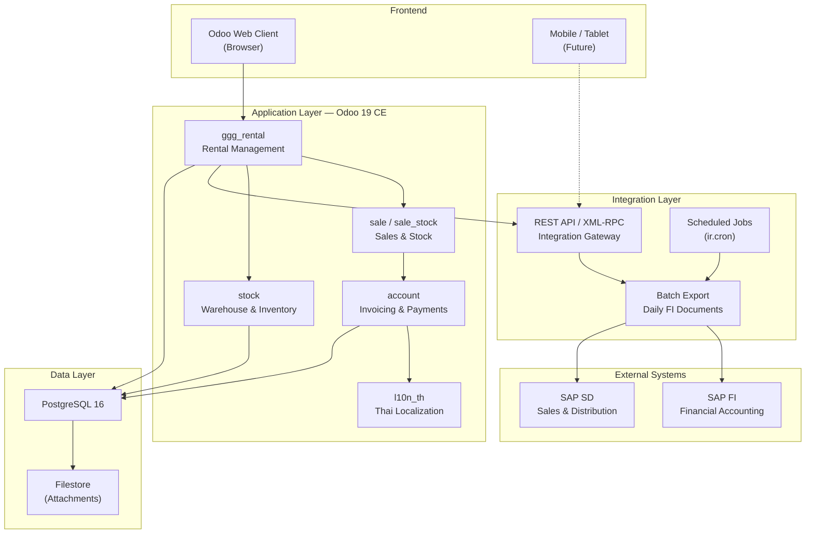

### Component Summary

| Component | Technology | Purpose |
|-----------|-----------|---------|
| Odoo 19 CE | Python 3.12 + OWL JS | Core application platform |
| ggg_rental | Odoo module (LGPL-3) | Rental lifecycle management |
| PostgreSQL 16 | Database | Transactional data storage |
| Docker Compose | Containerization | Deployment & environment management |
| SAP FI | ERP (External) | Financial accounting, GL postings |
| SAP SD | ERP (External) | Sales document management |

---

## 2. Rental Workflow

### 2.1 End-to-End Rental Lifecycle

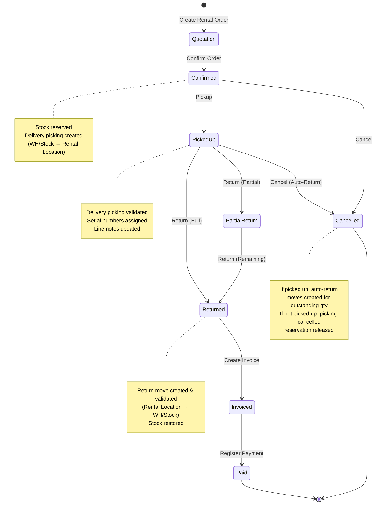

### 2.2 Pickup Process (Detail)

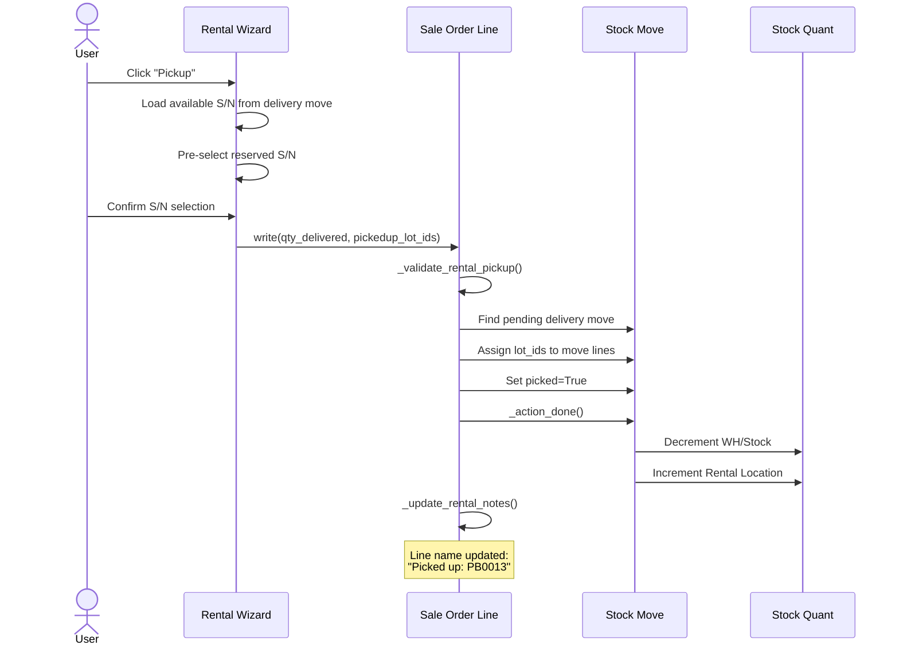

### 2.3 Return Process (Detail)

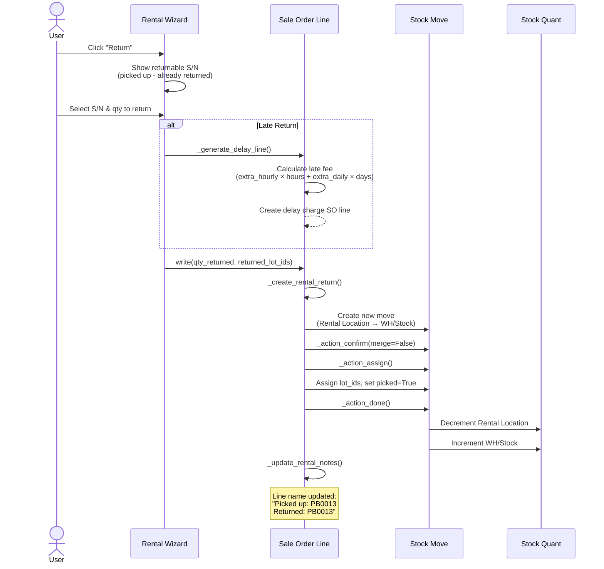

### 2.4 Stock Flow Visualization

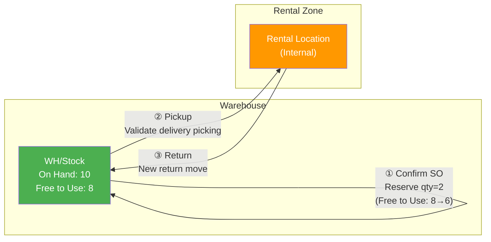

### 2.5 Serial Number Lifecycle

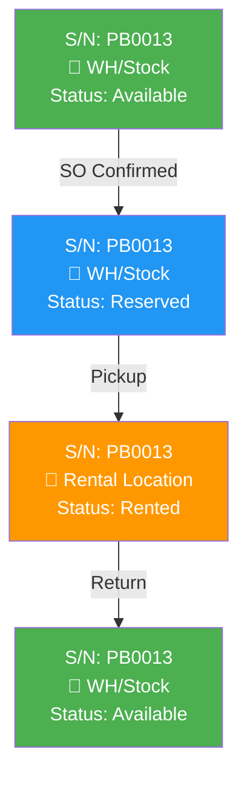

---

## 3. SAP Integration

### 3.1 Integration Overview

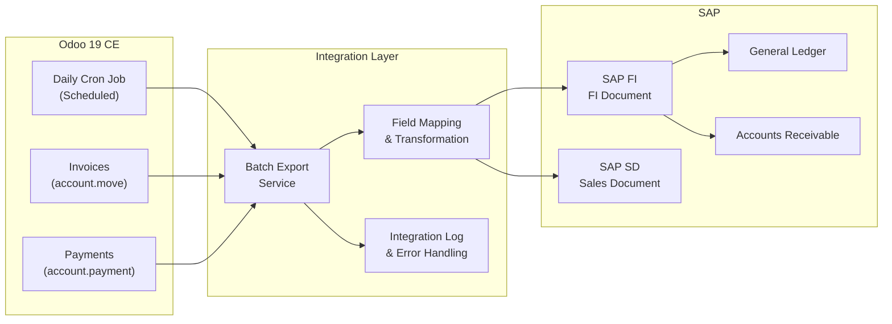

### 3.2 Daily Integration Flow

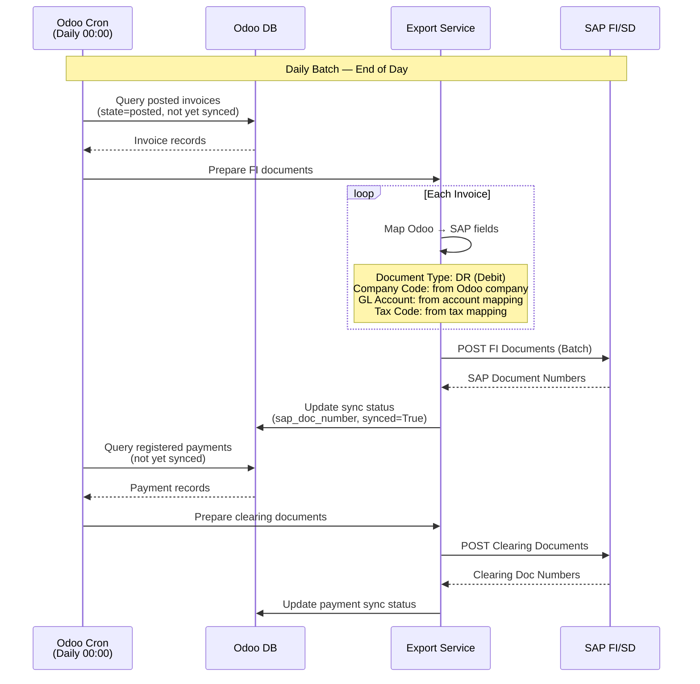

### 3.3 Field Mapping — Odoo Invoice → SAP FI Document

| Odoo Field | SAP FI Field | Description |
|-----------|-------------|-------------|
| `account.move.name` | `BELNR` (Reference) | Invoice number (INV/2026/00001) |
| `account.move.invoice_date` | `BUDAT` (Posting Date) | Invoice posting date |
| `account.move.invoice_date` | `BLDAT` (Document Date) | Document date |
| `res.company.name` | `BUKRS` (Company Code) | Company code mapping |
| `account.move.partner_id` | `KUNNR` (Customer) | Customer master mapping |
| `account.move.currency_id` | `WAERS` (Currency) | Currency code (THB) |
| `account.move.amount_untaxed` | `WRBTR` (Amount) | Net amount |
| `account.move.amount_tax` | Tax line amount | VAT amount |
| `account.move.amount_total` | Total | Gross amount |
| Invoice line account | `HKONT` (GL Account) | Revenue GL account |
| Tax code (VAT 7%) | `MWSKZ` (Tax Code) | Output tax code |

### 3.4 SAP Document Types

| Scenario | SAP Doc Type | Source in Odoo |
|----------|-------------|----------------|
| Rental Invoice | `DR` (Customer Invoice) | `account.move` (type=out_invoice) |
| Credit Note | `DG` (Credit Memo) | `account.move` (type=out_refund) |
| Payment Receipt | `DZ` (Payment) | `account.payment` |
| Late Fee Invoice | `DR` (Customer Invoice) | Delay charge line in invoice |

### 3.5 Integration Error Handling

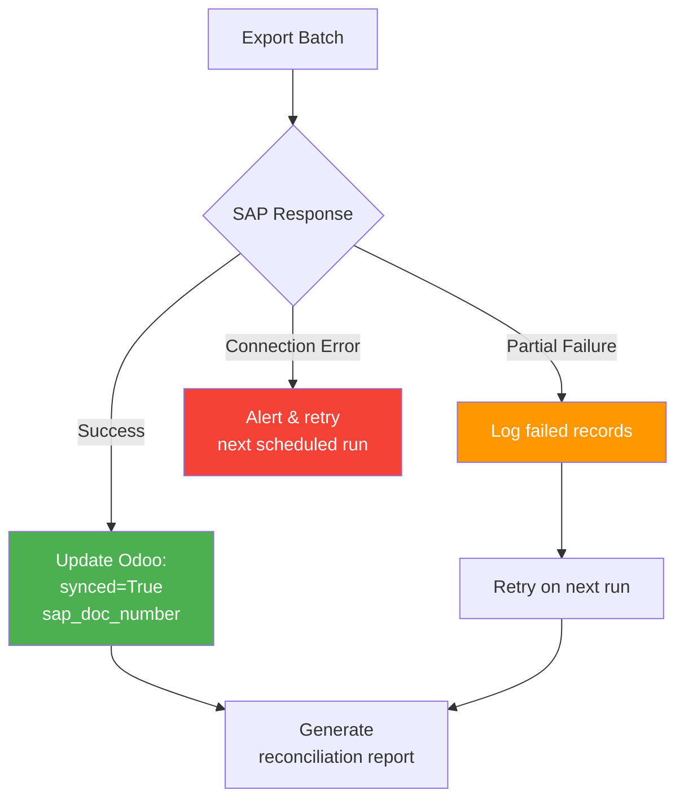

---

## 4. Data Flow Summary

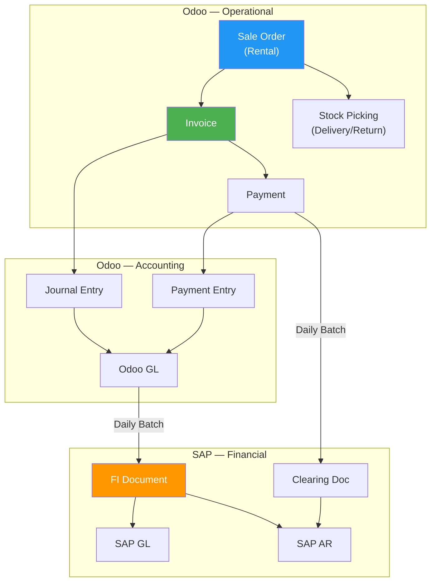

---

## 5. Deployment Architecture

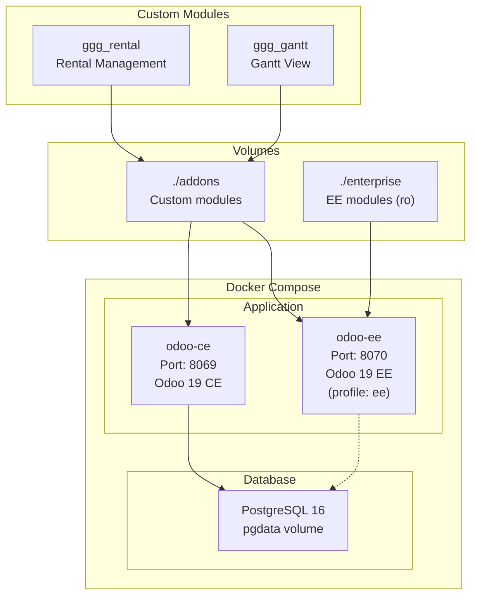

---

## 6. Key Decisions & Considerations

### SAP Integration Approach

| Option | Pros | Cons | Recommendation |
|--------|------|------|----------------|
| **Real-time API** | Immediate sync | Complex error handling, SAP availability dependency | Not recommended |
| **Daily batch** | Simple, reliable, auditable | Data delay (T+1) | **Recommended** |
| **Near real-time (queue)** | Low latency, decoupled | Infrastructure complexity (message broker) | Future phase |

### Integration Technology Options

| Option | Description | Fit |
|--------|------------|-----|
| **Odoo Cron + Python** | Scheduled job exports CSV/JSON, calls SAP RFC/BAPI | Simple, no extra infra |
| **Middleware (MuleSoft, etc.)** | Enterprise integration platform | Overkill for this scope |
| **SAP PI/PO** | SAP's own integration platform | If SAP team mandates it |
| **File-based (SFTP)** | Odoo exports flat file, SAP imports via batch input | Low-tech, proven pattern |

### Recommended: Odoo Cron + File Export

```
Odoo (Daily Cron)
  → Generate CSV/iDoc flat file
  → Upload to SFTP / shared folder
  → SAP Batch Input picks up file
  → Posts FI documents
  → Returns status file
  → Odoo reads status & updates sync flag
```

---

## 7. Open Items

- [ ] SAP company code mapping to Odoo company
- [ ] SAP customer master sync (manual or automated?)
- [ ] GL account mapping table between Odoo CoA and SAP CoA
- [ ] SAP tax code mapping for Thai VAT 7%
- [ ] File format specification (CSV, iDoc, BAPI?)
- [ ] SFTP / connectivity details
- [ ] Error notification channel (email, LINE, etc.)
- [ ] Reconciliation report requirements
- [ ] Go-live cutover plan (parallel run period?)
