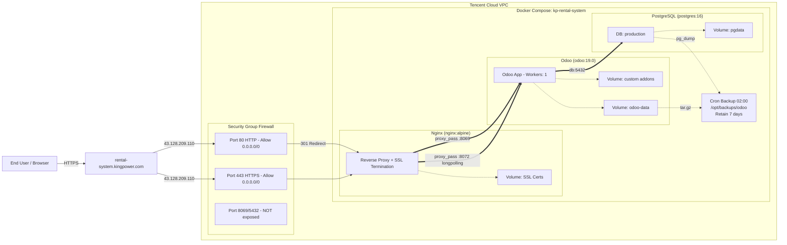

```mermaid
graph LR
    User["End User / Browser"]
    DNS["rental-system.kingpower.com"]

    subgraph TencentCloud ["Tencent Cloud VPC"]
        subgraph SG ["Security Group Firewall"]
            Allow80["Port 80 HTTP - Allow 0.0.0.0/0"]
            Allow443["Port 443 HTTPS - Allow 0.0.0.0/0"]
            Deny["Port 8069/5432 - NOT exposed"]
        end

        subgraph Docker ["Docker Compose: kp-rental-system"]
            subgraph NginxBox ["Nginx (nginx:alpine)"]
                Nginx["Reverse Proxy + SSL Termination"]
                Certs["Volume: SSL Certs"]
            end
            subgraph OdooBox ["Odoo (odoo:19.0)"]
                Odoo["Odoo App - Workers: 1"]
                Addons["Volume: custom addons"]
                OdooData["Volume: odoo-data"]
            end
            subgraph DBBox ["PostgreSQL (postgres:16)"]
                PG["DB: production"]
                PGData["Volume: pgdata"]
            end
            Backup["Cron Backup 02:00\n/opt/backups/odoo\nRetain 7 days"]
        end
    end

    User -->|HTTPS| DNS
    DNS -->|43.128.209.110| Allow443
    DNS -->|43.128.209.110| Allow80
    Allow80 -->|301 Redirect| Nginx
    Allow443 --> Nginx
    Nginx -.-> Certs
    Nginx ==>|proxy_pass :8069| Odoo
    Nginx ==>|proxy_pass :8072 longpolling| Odoo
    Odoo -.-> Addons
    Odoo -.-> OdooData
    Odoo ==>|db:5432| PG
    PG -.-> PGData
    PG -.->|pg_dump| Backup
    OdooData -.->|tar.gz| Backup
```