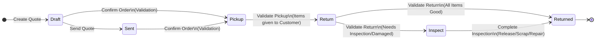
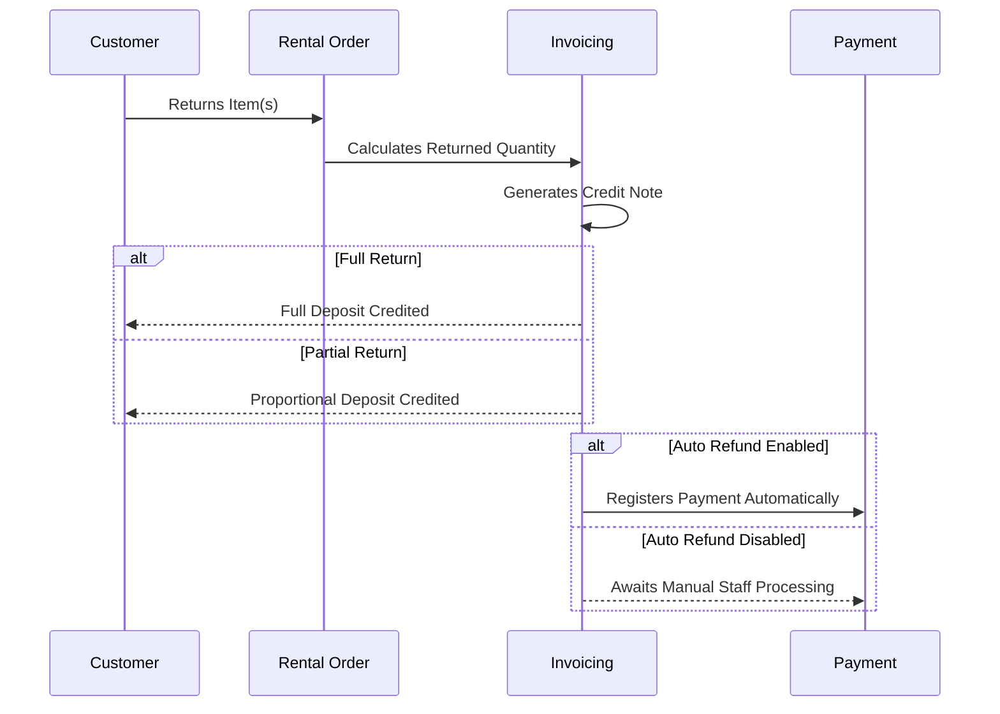
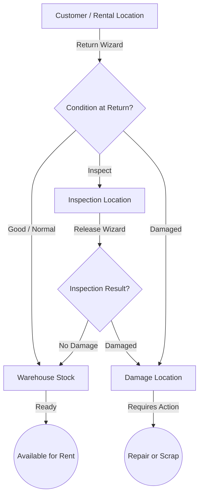

# Rental Process Workflow

This document outlines the standard rental process workflow, including validation, invoicing, deposit handling, return inspection, and damage assessment flows.

## High-Level Lifecycle Flow

## State Descriptions & Validation Actions

| State | Description & Validation Actions | Stock Location Status |
|---|---|---|
| **Draft** | Initial quotation created for the customer. Pricing rules (daily, weekly, variant) are applied based on the duration. | Pre-allocation |
| **Sent** | Quotation has been sent to the customer for review. | Pre-allocation |
| **Pickup** | **Validation:** Order is confirmed.  **Invoicing:** Invoices and deposit invoices are generated and Payments are collected.  Items are awaiting pickup by the customer or delivery. | Warehouse Stock |
| **Return** | **Validation:** Items have been validated as picked up and are currently with the customer. | Rental Location |
| **Inspect** | **Validation:** Items returned require deep evaluation. They have been routed to the Inspection or Damage Location. | Inspection Location / Damage Location |
| **Returned** | **Validation:** All items have been fully returned, inspected, and any applicable deposits have been refunded. | Warehouse Stock / Damage Location |

---

## Invoicing & Deposit Management

Handling payments securely and accurately is a critical part of the rental validation process.

### Split Invoicing on Order Confirmation
When an order is confirmed, the system separates standard rental charges from deposit charges:
- **Mixed Orders:** Generate two separate invoices (one invoice specifically for the deposit only, and a second invoice for the rental lines).
- **Rental-Only Orders:** Generate a single invoice for the rental cost.
- **Deposit-Only Orders:** Generate a single invoice for the deposit.

### Deposit Refunds on Return

As items are returned via the Return Wizard, the previously invoiced deposits are processed for refund. 

**Partial Returns:** If a customer returns only a subset of their rented items initially, a proportional credit note is generated based on the quantity returned. Additional credit notes are generated for downstream partial returns until the full deposit is refunded.

---

## Return & Inspection Routing

When items are validated during return, the return wizard dictates the inventory routing of each specific item based on its exact condition.

### Routing Rules & Inventory Flow

1. **Good Condition:** 
   - Routed directly back to **Warehouse Stock**.
   - Made immediately available and rentable for future orders.
   - If all items in an order are returned in good condition, the order state skips `Inspect` and jumps directly to `Returned`.
2. **Inspect:** 
   - Temporarily routed to the **Inspection Location** pending a deep validation check.
   - These items are blocked from showing as rentable.
   - Uses the specific Release Wizard to finalize the condition (No Damage vs. Damaged).
   - If any item in an order requires inspection, the order status moves to `Inspect`.
3. **Damaged:** 
   - Routed to the **Damage Location** for quarantine.
   - These items are flagged to generate a damage fee + log on the order.
   - Resolving items from the Damage Location happens outside of the custom rental flow via standard Odoo Repair or Scrap operations.
